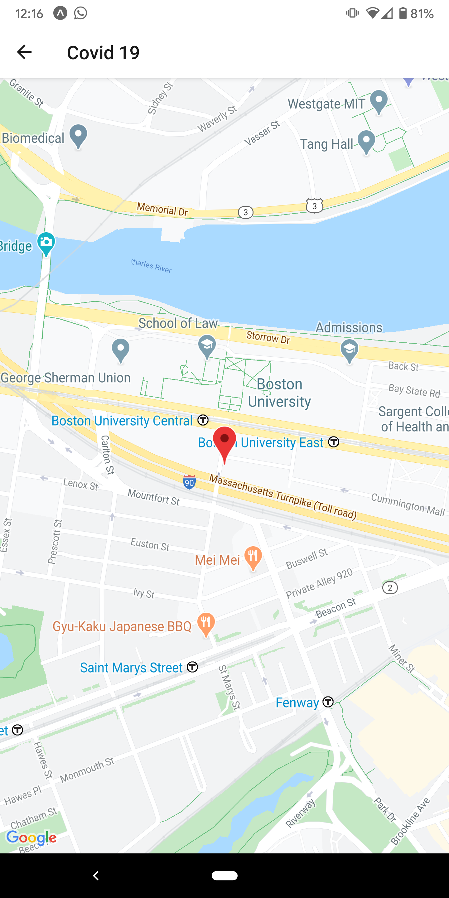
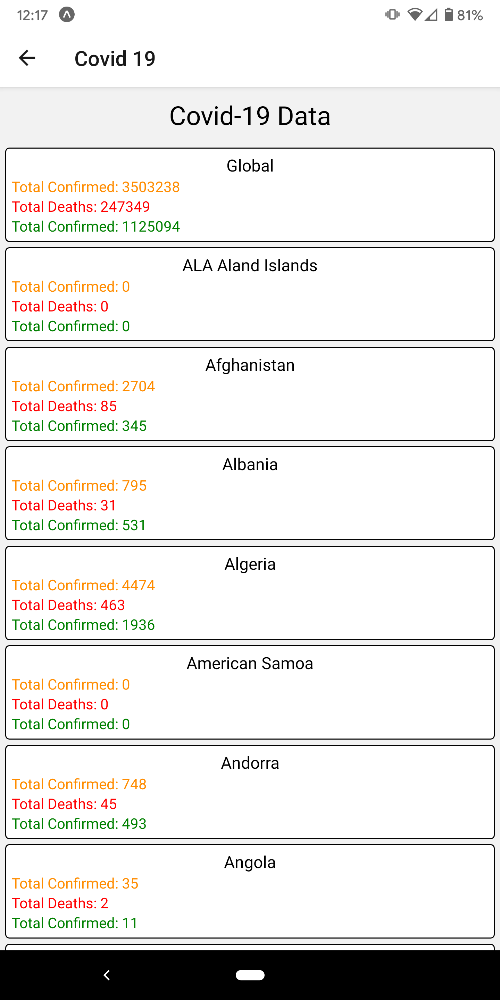
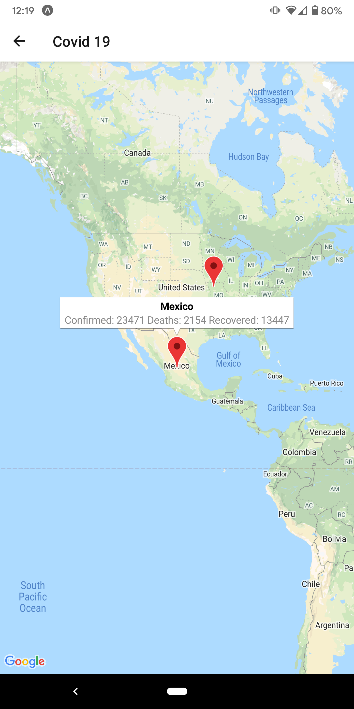

# Civid-19 React Native App

## By David Abadi

### To Run App Locally

```Bash
    npm install
    npm start
```

On your phone install the expo client app. Scan the QR code in the terminal.

### Pictures



